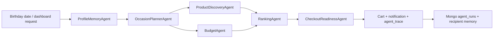

# Event Planner AI

Event Planner AI is a full-stack web application that leverages AI to automate event planning and smart shopping. Users can create personalized event plans, manage budgets, and receive intelligent product and gift recommendations, all through a modern, responsive dashboard.

## Features

- **AI-Powered Event Planning:** Generate event plans tailored to user preferences, event type, and budget.
- **Smart Shopping Cart:** View, manage, and track recommended products and gifts for your event.
- **Budget Management:** Set and monitor spending limits for different event categories (e.g., cake, decorations, gifts).
- **Personalized Recommendations:** Receive curated suggestions for gifts and event items based on your interests.
- **Agent Memory:** Recipient preferences, previous recommendations, and recent conversation turns are stored in MongoDB-backed LangChain chat history.
- **Product Discovery Agents:** Search Walmart/RapidAPI first, then web search, then a curated fallback catalog so demos remain reliable.
- **Birthday Notification Flow:** Store event dates and query due birthdays so the app can notify users when a recipient's celebration is coming up.
- **Calendar Integration:** Connect your calendar to sync and manage event schedules (UI ready for integration).
- **Modern UI:** Built with React, Tailwind CSS, and shadcn/ui for a seamless user experience.

## Tech Stack

- **Frontend:** React, Tailwind CSS, shadcn/ui, Vite
- **Backend:** Python Flask (REST API), LangChain, Azure OpenAI, MongoDB
- **Other:** Calendar integration, APScheduler, modular component architecture

## Agentic AI Architecture

PlannerAI now uses a coordinated agent workflow instead of one-off prompt calls:

1. **ProfileMemoryAgent**
   - Loads recipient profile, budget, birthday date, relationship, and recent conversation memory from MongoDB.
   - Uses LangChain `BaseChatMessageHistory` messages so each future run can reuse prior context.

2. **OccasionPlannerAgent**
   - Creates a structured event plan: gift strategy, decoration theme, cake suggestion, notification copy, and search-ready product queries.
   - Uses Azure OpenAI through LangChain `ChatPromptTemplate`.

3. **BudgetAgent**
   - Allocates the user's total budget across gifts, decorations, and cake with deterministic constraints.
   - Keeps financial logic predictable and testable instead of leaving it entirely to the LLM.

4. **ProductDiscoveryAgent**
   - Uses LangChain tool-style product discovery.
   - Searches Walmart products, falls back to web search, then falls back to a curated demo catalog.

5. **RankingAgent**
   - Scores candidates by budget fit, product availability, preference match, and source quality.
   - Returns selected cart items plus alternatives and an `agent_trace` for debugging/interview demos.

6. **CheckoutReadinessAgent**
   - Produces the final cart, notification text, estimated total, and `requires_user_confirmation: true`.
   - The architecture intentionally stops before payment automation so the user confirms purchases.

### Runtime Flow



### Key Backend Endpoints

- `POST /api/user-preferences` saves recipient preferences, budget, relationship, and birthday date.
- `POST /api/trigger-event` runs the full agent workflow and returns `plan`, `budget`, `cart`, `alternatives`, `notification`, `checkout`, and `agent_trace`.
- `GET /api/agent-runs/<summary>/latest` returns the most recent generated plan for a recipient/event.
- `GET /api/birthdays/due?days=7` returns recipients with birthdays/events due soon for notification UIs.

### Production Notes

- Use real retailer/search APIs in production. The fallback catalog is for graceful demos, not final commerce quality.
- Keep payment as an explicit user-confirmed action. The backend currently returns checkout readiness, not automatic payment execution.
- Add observability around `agent_trace`, product API latency, and ranking decisions.
- Add price refresh jobs before notification time because prices can change quickly.

## Getting Started

### Prerequisites
- Node.js (v16+ recommended)
- Python 3.8+

### Setup

#### 1. Clone the repository
```bash
git clone https://github.com/Akshanshkaushal/sparkathon-25-PlannerAI.git
cd sparkathon-25-PlannerAI
```

#### 2. Frontend Setup
```bash
cd frontend/event-dashboard
npm install
npm run dev
```
The frontend will be available at `http://localhost:5173` by default.

#### 3. Backend Setup
```bash
cd ../../backend
python -m venv venv
venv\Scripts\activate  # On Windows
# Or: source venv/bin/activate  # On Mac/Linux
pip install -r requirements.txt
python run.py
```
The backend will be available at `http://localhost:5000` by default.

Required backend environment variables:

```bash
MONGO_URI=mongodb://localhost:27017/planner_ai
AZURE_OPENAI_API_KEY=...
AZURE_OPENAI_ENDPOINT=...
AZURE_OPENAI_GPT_DEPLOYMENT_NAME=...
AZURE_OPENAI_GPT_DEPLOYMENT_VERSION=...
WALMART_API_KEY=... # optional, fallback discovery still works without it
```

## Folder Structure

```
backend/
  app/
    agents/
    api/
    services/
frontend/
  event-dashboard/
    src/
      components/
      pages/
      api/
```

## Usage
1. Fill out the event form with your preferences and budget.
2. Generate an event plan to receive AI-powered recommendations.
3. Review your cart, event details, and budget breakdown.
4. (Optional) Connect your calendar for event scheduling.

## Contributing
Pull requests are welcome! For major changes, please open an issue first to discuss what you would like to change.

## License
This project is licensed under the MIT License.

---

**Event Planner AI** — Smart Shopping & Planning for Every Occasion
